# Taller RoundRobin-DockeryAws

## Despliege en localhost
Una vez crado el proyecto en nuestro computador, se debe desplegar las imagenes y los contenedores, con lo
una vez ubicados en la raiz del proyecto escribimos el siguiente comando:

```docker-compose up -d```

Este comando lo que hace es generar una configuracion automatica dada en un archivo llamado ```docker-compose.yml```
que tiene el siguiente contenido

   ```
       version: '2'

        services:
          db:
            image: mongo:latest
            container_name: mongoDB
            environment:
              MONGO_INITDB_DATABASE: RoundRobinService
              MONGO_INITDB_ROOT_USERNAME: Admin
              MONGO_INITDB_ROOT_PASSWORD: Admin
            volumes:
              - ./init-mongo.js:/docker-entrypoint-initdb.d/init-mongo.js:ro
              - mongodb:/data/db
              - mongodb_config:/data/configdb
            ports:
              - 27017:27017
            command: mongod
        
        
          app-lb-roundrobin:
            build:
              context: ./RoundRobin
              dockerfile: Dockerfile
            depends_on:
              - logservice1
              - logservice2
              - logservice3
            container_name: app-lb-roundrobin
            ports:
              - "35000:6000"
        
          logservice1:
            build:
              context: ./RoundRobin
              dockerfile: Dockerfile
            depends_on:
              - db
            container_name: logservice1
            ports:
              - "35001:6000"
        
          logservice2:
            build:
              context: ./RoundRobin
              dockerfile: Dockerfile
            depends_on:
              - db
            container_name: logservice2
            ports:
              - "35002:6000"
        
          logservice3:
            build:
              context: ./RoundRobin
              dockerfile: Dockerfile
            depends_on:
              - db
            container_name: logservice3
            ports:
              - "35003:6000"
        
        
        volumes:
          mongodb:
          mongodb_config:
   ```

Una vez ejecutado el comando anterior, se obtiene en consola lo siguiente

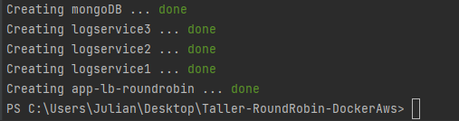

Para revisar por consola que se hallan creado las imagenes utilizamos el siguiente comando

   ```
      docker images
   ```
El cual nos mostrara el siguiente resultado

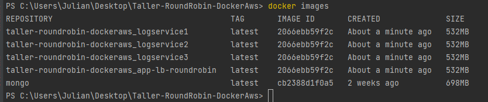

Para saber por consola si estan corriendo, se utiliza el siguiente comando

   ```
      docker ps
   ```
Obtenemos el siguiente resultado

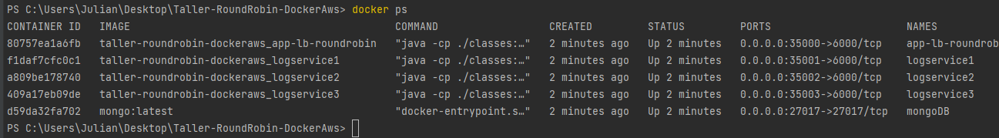


Utilizando el docker desktop tambien podemos verificar de una forma grafica, la creacion de las imagenes y los
contenedores y si estos estan corriendo, como se muestra a continuacion

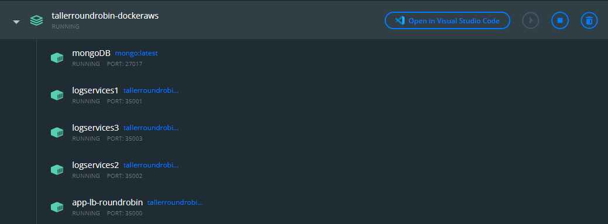


Despues podremos acceder al proyecto desplegado en nuestro docker local, consultando la siguiente url

   ```
      http://localhost:35000/
   ```
Donde el puerto: 35000 es el puerto al que se enlazo con uno fisico de la maquina local y que este nos permite
acceder, como se muestra a continuacion

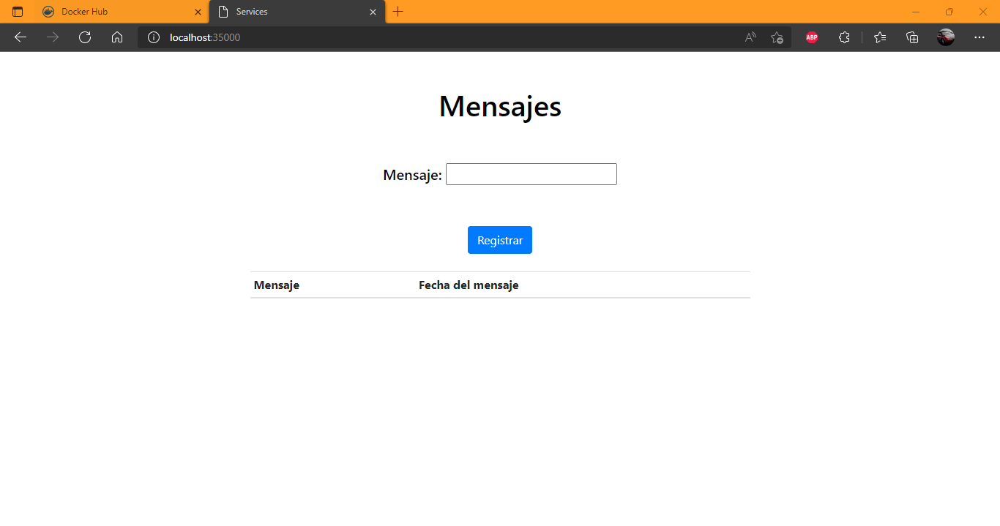


## Despliegue en Docker Hub
Para realizar el despliegue en docker hub, se crea un repositorio para subir el proyecto para despues poder
desplegar las imagenes en AWS

* Nombre de Usuario: arep2022
* Nombre del Repositorio: round_robin_docker
* url: https://hub.docker.com/repository/docker/arep2022/round_robin_docker

Ahora se crearan nuevos tag para las imagenes, que esto es para tener una referencia de donde queremos subirlo,
en este caso es en el repositorio antes mencionado en docker hub. Para esto el comando es el siguiente

   ```
      docker tag tallerroundrobin-dockeraws_app-lb-roundrobin:latest arep2022/round_robin_docker:app-lb-roundrobin
   ```

   ```
      docker tag tallerroundrobin-dockeraws_logservice1:latest arep2022/round_robin_docker:logservice1
   ```

   ```
      docker tag tallerroundrobin-dockeraws_logservice2:latest arep2022/round_robin_docker:logservice2
   ```

   ```
      docker tag tallerroundrobin-dockeraws_logservice3:latest arep2022/round_robin_docker:logservice3
   ```


Con lo cual en la consola obtenemos el siguiente resultado
  
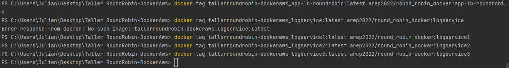

   ```
       docker tag mongo:latest arep2022/round_robin_docker:mongodb
   ```

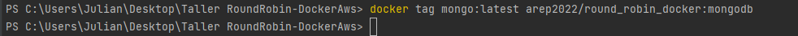

Despues podemos verificar que se crearon con

   ```
      docker images
   ```
Obteniendo como resultado

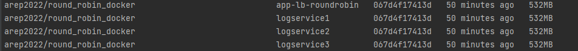

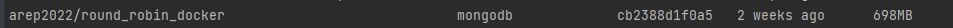

Ahora lo que hay que hacer es subirlas al repositorio en docker hub,si no se ha iniciado sesion se hace
primero un ```docker login```, en donde se le pediran las credenciales. Despues del inicio de sesion se
utiliza el siguiente comando

   ```
      docker push arep2022/round_robin_docker:app-lb-roundrobin
   ```
   ```
      docker push arep2022/round_robin_docker:logservice1
   ```
   ```
      docker push arep2022/round_robin_docker:logservice2
   ```
   ```
      docker push arep2022/round_robin_docker:logservice3
   ```
   ```
      docker push arep2022/round_robin_docker:mongodb
   ```
Una vez subidas, podemos verificar en docker hub si realmente se subieron sin ningun problema, como se
muestra a continuacion

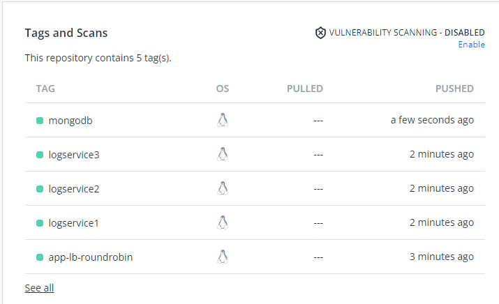


## Creacion Maquina en AWS
Para poder desplegar en AWS se debe crear una maquina virtual EC2, para esto nos dirigimos a la consola de
AWS e iniciarla y una vez iniciada se nos pondra en verde el indicador

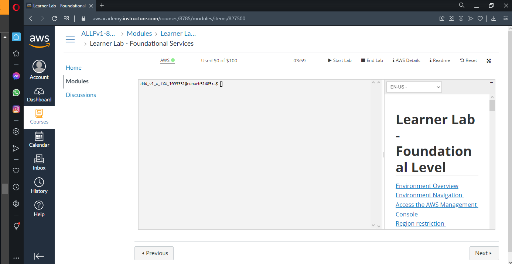

Le damos click en el indicador verde y nos enviara a la pagina donde podremos lanzar la maquina virtual
EC2 y en donde podemos seleccionar cualquiera de las opciones que dice apta para la capa, en este caso
se selecciona la primera

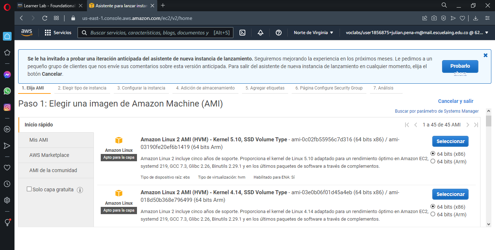

Una vez seleccionada, nos mostrara las caracteristicas del sistema operativa, se deja por defecto la opcion
que se muestra y le damos a revisar y lanzar

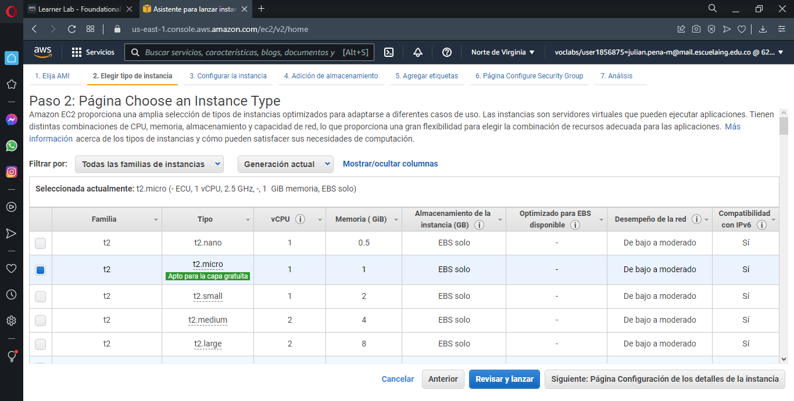

Despues nos muesra todas las caracteristicas de la maquina, en donde no se va a tocar nada y despues oprimimos
en lanzar

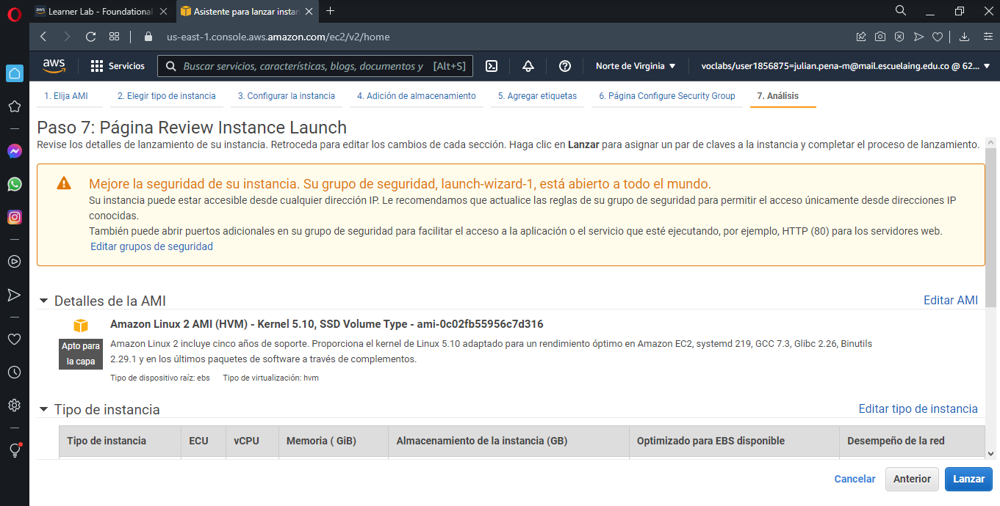

Despues de darle a lanzar, encontraremos el siguiente menu, en donde se debe dar en "Crear nuevo par de llaves"
, le damos un nombre, las descargamos y despues damos en lanzar instancia.

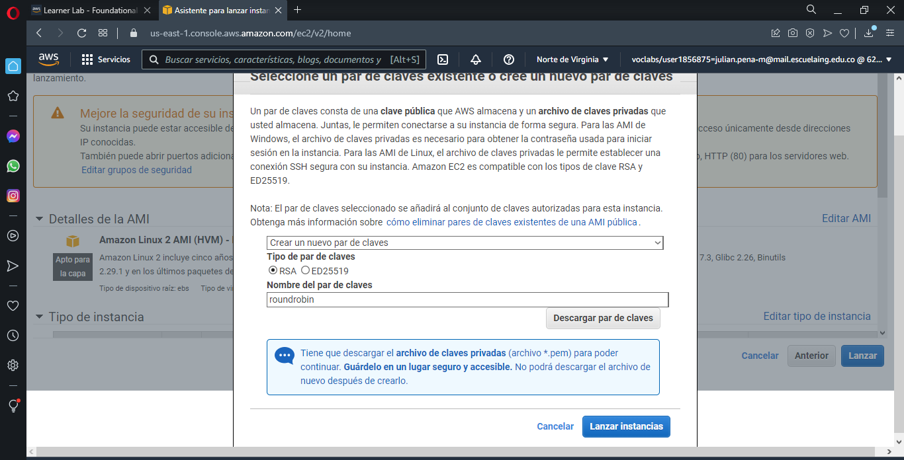

Despues podemos revisar la instancia en el panel, donde a continuacion le damos en acciones y en conectar

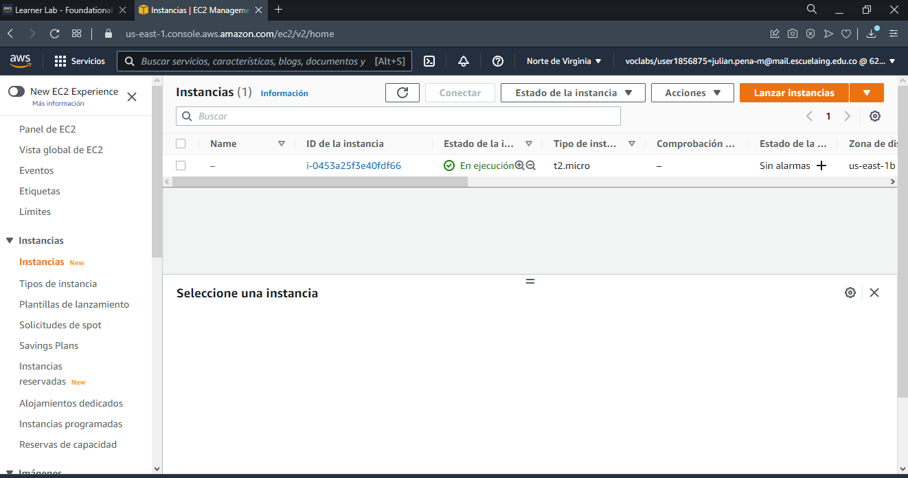

Se despliega un menu donde nos da la opcion de conectarnos via SSH, utilizando el siguiente comando

   ```
      ssh -i "roundrobin.pem" ec2-user@ec2-3-94-180-238.compute-1.amazonaws.com
   ```

Con el par de llaves en la ubicacion donde estan descargadas, en mi caso en descargas se pone el comando anterior para
conectarse a la maquina EC2 via ssh como se muestra a continuacion

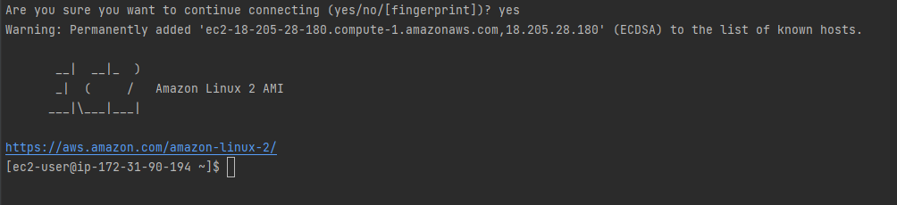

Escribimos el siguiente comando para actualizar el sistema a la version mas reciente

   ```
      sudo yum update -y
   ```

Despues toca instalar docker en nuestro ambiente con el siguiente comando
   ```
      sudo yum install docker
   ```

Despues de instalar asignaremos al usuario docker permisos de administrador para no tener que usar el comando
sudo cada vez que se ejecute un comando docker

   ```
      sudo usermod -a -G docker ec2-user
   ```

Despues de esto saldremos de la maquina EC2 y volveremeos a entrar para que se apliquen los cambios

   ```
      exit
   ```
   ```
      ssh -i "roundrobin.pem" ec2-user@ec2-3-94-180-238.compute-1.amazonaws.com
   ```
Despues de volver a ingresar podemos iniciar el docker con el siguiente comando

   ```
      sudo service docker start
   ```

Y al consultar las imagenes nos daremos cuenta que no existe ninguna, por lo cual 
las debemos desplegar en nuestro ambiente de la maquina EC2
   ```
      docker images
   ```

## Configuracion puertos AWS
Ahora que tenemos instalado nuestra maquina podemos desplegar nuestras imagenes docker en el, 
pero para eso necesitamos crear reglas de entrada para que la maquina pueda leer los puertos que 
necesitamos; por lo cual iremos a nuestra instancia desde la consola de amazón y nos dirigiremos a 
la pestaña de "seguridad" y oprimiremos en el link de "grupos de seguridad"

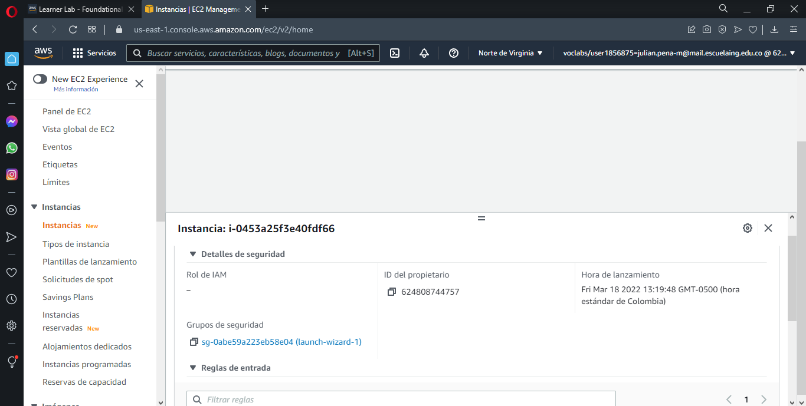

En reglas de entrada le damos a "editar reglas de entrada"

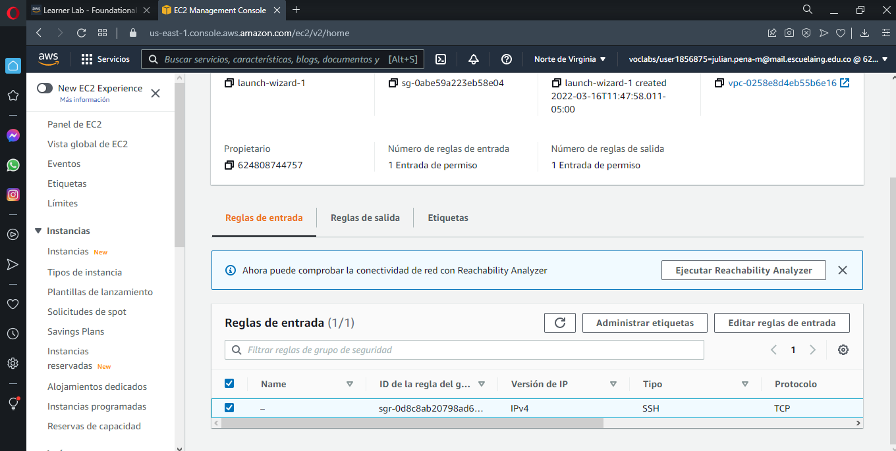

En la pestaña que aparece, se agregaran reglas, una por cada puerto, en este caso seran 5 reglas, una 
para el puerto ```35004``` para roundrobin, ```35005``` para logservice1, ```35006``` para logservice2, 
```35007``` para logservice3 y ```27017``` para mongo y queda de la siguiente forma

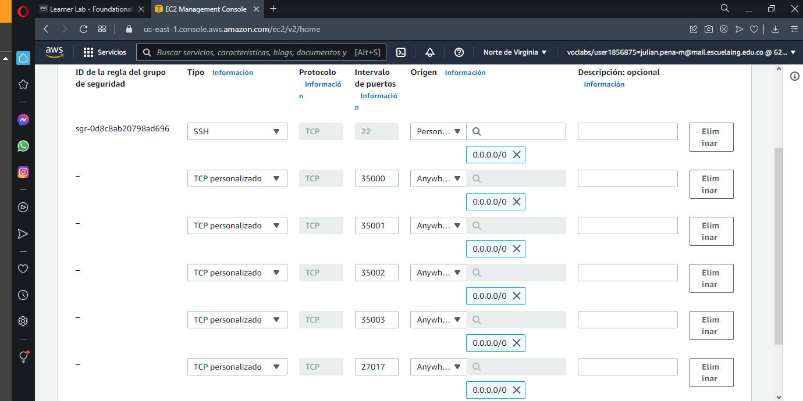

Y ahora haremos el mismo proceso para las reglas de salida para que se pueda comunicar la información que 
envian entre puertos


## Despliegue en AWS
Se despliega en AWS, se ejecutan las imágenes que se encuentran en el repositorio para que las guarde y 
ejecute, con los siguientes comandos

   ```
     docker run -dp 35004:6000 --name rb arep2022/round_robin_docker:app-lb-roundrobin
   ``` 
   ```
     docker run -dp 35005:6000 --name lg1 arep2022/round_robin_docker:logservice1
   ```
   ```
     docker run -dp 35006:6000 --name lg2 arep2022/round_robin_docker:logservice2
   ```
   ```
     docker run -dp 35007:6000 --name lg3 arep2022/round_robin_docker:logservice3
   ```
   ```
     docker run -dp 27018:6000 --name bdm arep2022/round_robin_docker:mongodb
   ```