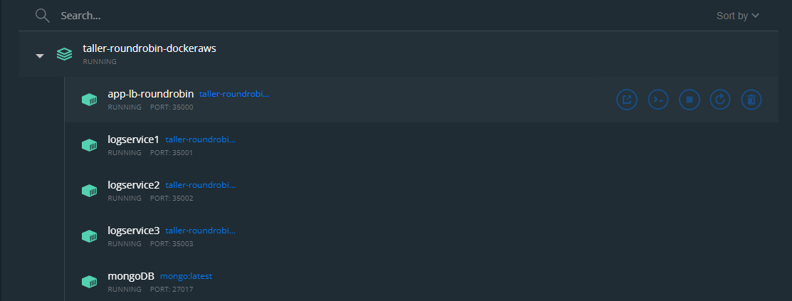

# Taller RoundRobin-DockeryAws

## Despliege en localhost
Una vez crado el proyecto en nuestro computador, se debe desplegar las imagenes y los contenedores, con lo
una vez ubicados en la raiz del proyecto escribimos el siguiente comando:

```docker-compose up -d```

Este comando lo que hace es generar una configuracion automatica dada en un archivo llamado ```docker-compose.yml```
que tiene el siguiente contenido

   ```
       version: '2'

        services:
          db:
            image: mongo:latest
            container_name: mongoDB
            environment:
              MONGO_INITDB_DATABASE: RoundRobinService
              MONGO_INITDB_ROOT_USERNAME: julian
              MONGO_INITDB_ROOT_PASSWORD: julian24
            volumes:
              - ./init-mongo.js:/docker-entrypoint-initdb.d/init-mongo.js:ro
              - mongodb:/data/db
              - mongodb_config:/data/configdb
            ports:
              - 27017:27017
            command: mongod
        
        
          app-lb-roundrobin:
            build:
              context: ./RoundRobin
              dockerfile: Dockerfile
            depends_on:
              - logservice1
              - logservice2
              - logservice3
            container_name: app-lb-roundrobin
            ports:
              - "35000:6000"
        
          logservice1:
            build:
              context: ./RoundRobin
              dockerfile: Dockerfile
            depends_on:
              - db
            container_name: logservices1
            ports:
              - "35001:6000"
        
          logservice2:
            build:
              context: ./RoundRobin
              dockerfile: Dockerfile
            depends_on:
              - db
            container_name: logservices2
            ports:
              - "35002:6000"
        
          logservice3:
            build:
              context: ./RoundRobin
              dockerfile: Dockerfile
            depends_on:
              - db
            container_name: logservices3
            ports:
              - "35003:6000"
        
        
        volumes:
          mongodb:
          mongodb_config:
   ```

Una vez ejecutado el comando anterior, se obtiene en consola lo siguiente


Para revisar por consola que se hallan creado las imagenes utilizamos el siguiente comando

   ```
      docker images
   ```
El cual nos mostrara el siguiente resultado


Para saber por consola si estan corriendo, se utiliza el siguiente comando

   ```
      docker ps
   ```
Obtenemos el siguiente resultado


Utilizando el docker desktop tambien podemos verificar de una forma grafica, la creacion de las imagenes y los
contenedores y si estos estan corriendo, como se muestra a continuacion




Despues podremos acceder al proyecto desplegado en nuestro docker local, consultando la siguiente url

   ```
      http://localhost:35000/
   ```
Donde el puerto: 35000 es el puerto al que se enlazo con uno fisico de la maquina local y que este nos permite
acceder, como se muestra a continuacion


## Despliegue en Docker Hub
Para realizar el despliegue en docker hub, se crea un repositorio para subir el proyecto para despues poder
desplegar las imagenes en AWS

* Nombre de Usuario: arep2022
* Nombre del Repositorio: round_robin_docker

Ahora se crearan nuevos tag para las imagenes, que esto es para tener una referencia de donde queremos subirlo,
en este caso es en el repositorio antes mencionado en docker hub. Para esto el comando es el siguiente

   ```
      docker tag tallerroundrobin-dockeraws_app-lb-roundrobin:latest arep2022/round_robin_docker:app-lb-roundrobin
   ```

   ```
      docker tag tallerroundrobin-dockeraws_logservice1:latest arep2022/round_robin_docker:logservice1
   ```

   ```
      docker tag tallerroundrobin-dockeraws_logservice2:latest arep2022/round_robin_docker:logservice2
   ```

   ```
      docker tag tallerroundrobin-dockeraws_logservice3:latest arep2022/round_robin_docker:logservice3
   ```


Con lo cual en la consola obtenemos el siguiente resultado
  


   ```
       docker tag mongo:latest arep2022/round_robin_docker:mongodb
   ```


Despues podemos verificar que se crearon con

   ```
      docker images
   ```
Obteniendo como resultado


Ahora lo que hay que hacer es subirlas al repositorio en docker hub,si no se ha iniciado sesion se hace
primero un ```docker login```, en donde se le pediran las credenciales. Despues del inicio de sesion se
utiliza el siguiente comando

   ```
      docker push arep2022/round_robin_docker:app-lb-roundrobin
   ```
   ```
      docker push arep2022/round_robin_docker:logservice1
   ```
   ```
      docker push arep2022/round_robin_docker:logservice2
   ```
   ```
      docker push arep2022/round_robin_docker:logservice3
   ```
   ```
      docker push arep2022/round_robin_docker:mongodb
   ```
Una vez subidas, podemos verificar en docker hub si realmente se subieron sin ningun problema, como se
muestra a continuacion


